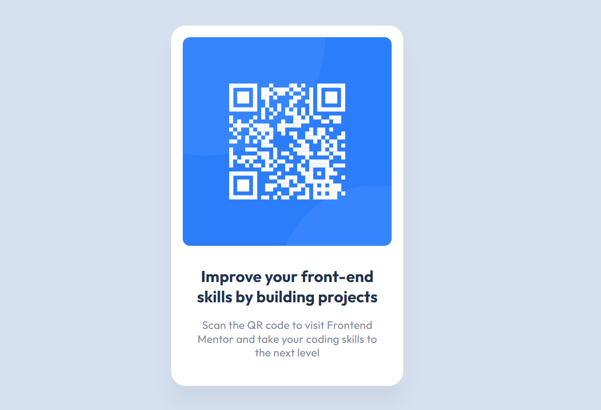

# Frontend Mentor - QR code component solution

## Table of contents

- [Overview](#overview)
  - [Screenshot](#screenshot)
  - [Links](#links)
- [My process](#my-process)
  - [Built with](#built-with)
  - [What I learned](#what-i-learned)
  - [Continued development](#continued-development)
  - [Useful resources](#useful-resources)
- [Acknowledgments](#acknowledgments)

## Overview

This is a solution to the [QR code component challenge on Frontend Mentor](https://www.frontendmentor.io/challenges/qr-code-component-iux_sIO_H).

### Screenshot

### Links

- Solution URL: [Solution URL here](https://github.com/NunuAbuashvili/QR-Code-Component.git)
- Live Site URL: [Live site URL here](https://nunuabuashvili.github.io/QR-Code-Component/)

## My process

### Built with

- Semantic HTML5 markup
- CSS custom properties
- Flexbox

### What I learned

This was the first project that I have built using HTML and CSS. I learned:

- Basic HTML structure and elements;
- CSS selectors;
- :root selector in CSS;
- Centering elements using flexbox.

First, I used pixels as length units, lately I have modified the project, in order to make it more responsive. I used rem instead of pixels, and got rid of some CSS properties, that could have been expressed more flexibly.

### Continued development

I would like to work more on responsive design and CSS flexbox in future projects.

### Useful resources

- [How to Center Anything with CSS](https://www.freecodecamp.org/news/how-to-center-anything-with-css-align-a-div-text-and-more/) - This is an amazing article about centering DIV, text and more with CSS.

## Acknowledgments

I would like to thank Bitcamp 101 (Georgia) for amazing lectures, and also, my mentor Paata Gharibashvili who has helped me a lot while working on different projects.
